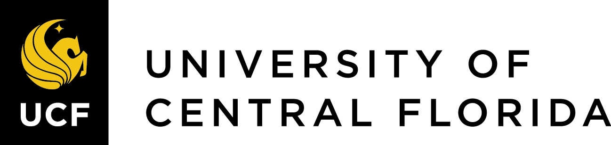

<!---->
<!---->

## General Information

This Software Carpentry workshop is sponsored by UCF Office of Research and conducted by the [RCI](https://rci.research.ucf.edu/) team.

Software Carpentry aims to help researchers get their work done in less time and with less pain by teaching them basic research computing skills in a supportive & inclusive environment. This hands-on workshop will cover basic concepts and working with the Unix shell.

**Who:** This workshop is aimed at graduate students and other researchers, but all are welcome to attend. This is a basics level workshop for an audience who intend to start working with Unix in the future. You don't need to have any previous knowledge of the tools that will be taught.  

**Where:** This training will take place online. The instructors will provide you with the information you will need to connect to this meeting.

**When:** Feb 11-12, 2021. 

**Description:** The Unix shell has been around longer than most of its users have been alive. It has survived so long because it's a power tool that allows people to do complex things with just a few keystrokes. More importantly, it helps them combine existing programs in new ways and automate repetitive tasks so they aren't typing the same things over and over again. Use of the shell is fundamental to using a wide range of other powerful tools and computing resources (including "high-performance computing" supercomputers). These lessons will start you on a path towards using these resources effectively.

**Prerequisites:** This lesson guides you through the basics of file systems and the shell.  If you have stored files on a computer at all and recognize the word "file" and either "directory" or "folder" (two common words for the same thing), you're ready for this lesson. If you're already comfortable manipulating files and directories, searching for files with `grep` and `find`, and writing simple loops and scripts, you probably want to explore the next lesson: [shell-extras](https://carpentries-incubator.github.io/shell-extras/).

**Requirements:** Participants must have access to a computer with a Mac, Linux, or Windows operating system (not a tablet, Chromebook, etc.) that they have administrative privileges on. They should have a few specific software packages installed (listed below).

<!--Accessibility: We are dedicated to providing a positive and accessible learning environment for all. Please notify the instructors in advance of the workshop if you require any accommodations or if there is anything we can do to make this workshop more accessible to you.-->

**Contact:** Please email <ResearchIT@ucf.edu> for more information.

<!---Roles: To learn more about the roles at the workshop (who will be doing what), refer to our Workshop FAQ.--->

<!--
> ## Prerequisites
>
> This lesson guides you through the basics of file systems and the
> shell.  If you have stored files on a computer at all and recognize
> the word "file" and either "directory" or "folder" (two common words
> for the same thing), you're ready for this lesson.
>
> If you're already comfortable manipulating files and directories,
> searching for files with `grep` and `find`, and writing simple loops
> and scripts, you probably want to explore the next lesson: [shell-extras](https://carpentries-incubator.github.io/shell-extras/).
{: .prereq}
-->
